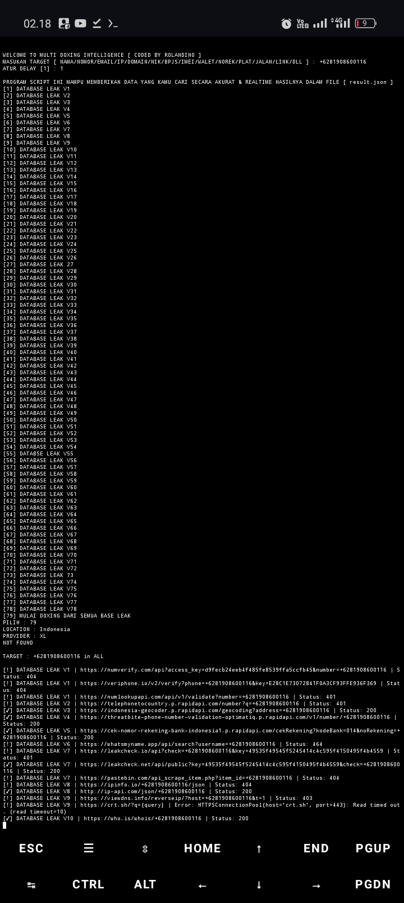
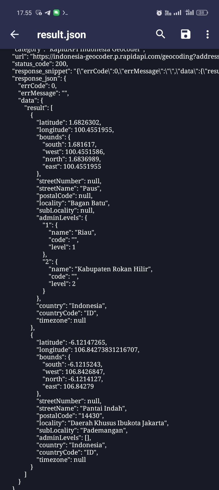

# DOXING TOOL — REALTIME EDITION 🔍

**MULTI-FEATURE DOXING TOOLS**   
**AUTHOR : Rolandino**

---

## Deskripsi Singkat 🎯

Script ini adalah *real-time doxing tool* berbasis Python, didesain untuk melakukan investigasi lengkap terhadap data target berdasarkan Nomor HP, Email, IP Address, Username, NIK, dan informasi lainnya.

Tools ini menggabungkan lebih dari **80 fitur** OSINT dengan basis data Api Public & Api Premium, Sangat cocok untuk investigasi digital, sosial engineering, dan keperluan forensik.

---

 

## Fitur Utama 🔥

Berikut adalah daftar lengkap semua fitur yang tersedia di tools ini:

### Nomor HP 📱
- Pelacakan lokasi HLR dan metadata pengguna
- Provider, status aktif, dan estimasi lokasi terkini

### Email 📧
- Validasi dan reputasi email
- Riwayat penggunaan & kemungkinan kebocoran

### Username 🧑
- Pencarian username di ratusan database bocor
- Deteksi data pribadi terkait seperti nomor & lokasi

### IP Address 🌐
- Deteksi lokasi, ASN, proxy/VPN, dan jenis koneksi

### NIK 🆔
- Cek data KTP: Nama, TTL, Gender, Alamat
- Koordinat Maps (jika tersedia)

### KK 👨‍👩‍👧
- Hubungan keluarga, validasi & kecocokan data

### Nama Lengkap 🪪
- Pelacakan nama di database bocor & sosial bansos

### TTL (Tempat & Tanggal Lahir) 📅
- Verifikasi terhadap data NIK & nama

###  Gender & Agama ⚤
- Deteksi berdasarkan dataset demografis

### Status Pernikahan & Pendidikan 💍
- Estimasi status pernikahan & level pendidikan

### Pekerjaan & Ibu Kandung 👩‍🍼
- Estimasi profesi & pencocokan nama ibu

### Lokasi Google Maps 🗺️
- Otomatis generate link koordinat lokasi

### KTP & KK (Dukcapil) 🆔
- Pencocokan melalui file JSON/CSV

### BPJS, NPWP, SIM 🧾
- Validasi keberadaan identitas dan status

### Kendaraan 🚗
- Pengecekan data kendaraan via plat/rangka

### Kategori Sosial & Bantuan 📊
- Cek data bansos (PKH, BPNT, dan lainnya)

### Data Bocor 💥
- Pengecekan email/NIK/nomor di basis bocor lokal

### GeoIP Silent Tracking 🛰️
- Deteksi IP dan device pengguna script

### Media Link Finder 🔎
- Prediksi URL media sosial dari username

### Cross-Check 🧬
- Pencocokan hasil NIK vs Email/Nomor HP

### IMEI 📱
- Validasi IMEI dan metadata perangkat

### EXIF Image Scanner 🖼️
- Ambil metadata gambar (lokasi, kamera, dll)

### Truecaller Lookup 📞
- Cek nama pemilik nomor telepon

### Phishing Tracker 🎣
- Lacak pelaku phishing via URL jebakan

### Jejak Sosial 🌐
- Cari akun sosial dari nomor, email, nama

---

## Output Doxing 📂

Semua hasil akan disimpan dalam file `result.json` Pastikan mengecek file tersebut setelah semua proses selesai

---

##  Cara Menjalankan Script  ▶️

Tonton tutorial lengkap di YouTube 📌
https://youtu.be/GTnDkR_z6VE?si=pS6KAOjiE99Mczci

Follow Facebook untuk update tools terbaru 🔥  
https://www.facebook.com/profile.php?id=100094471519310

---

##  Disclaimer  ⚠️

Program ini dibuat untuk tujuan edukasi dan penelitian OSINT.  
**Dilarang keras** menggunakan tools ini untuk tindakan ilegal, peretasan, penipuan, doxing publik tanpa izin, atau bentuk kriminal lainnya, Semua risiko ditanggung oleh pengguna. Gunakan dengan tanggung jawab!

---

## Support & Update 🔐

Gabung komunitas kami di :  
https://t.me/Crackers_Teamm  
Crackers Community 🎭

---

**Versi:** Final Release 1.0  
**Total Api Base Leak:** 80+ 🔥
